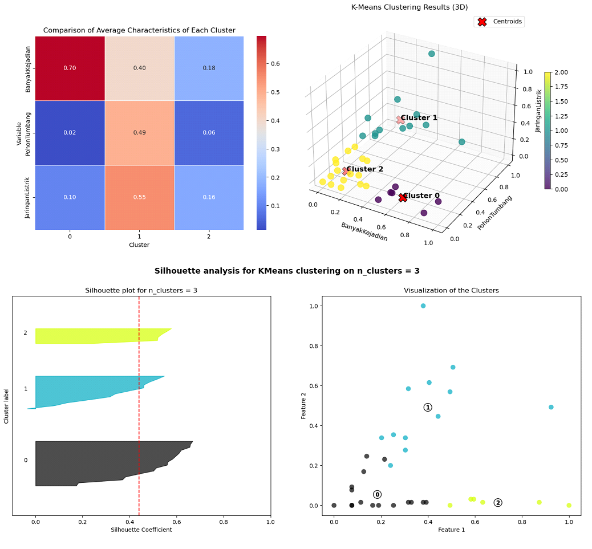

# Portfolio
---
## Data Science

### Analyzing Multiclass Land Cover and Spatial Point Patterns on Sentinel-2 Imagery Using Machine Learning and Deep Learning

I classified land cover around Universitas Riau (UNRI) using Sentinel-2 imagery (10 m resolution), focusing on NIR and SWIR bands. I compared Support Vector Machine (SVM), Naïve Bayes (NB), and Backpropagation Neural Network (BNN) models using a stratified 80-20 split. SVM achieved the highest accuracy, averaging 91.15% in 2022 and 83.90% in 2023 with minimal variance, confirming its reliability. Spatial analysis revealed significant non-vegetation concentration near major infrastructure, highlighting urban development impacts. Potential growth zones within 3–5 km of UNRI were identified, supporting the need for sustainable land-use planning in line with Law No. 26/2007 on Spatial Planning.

---
### K-Means Clustering for Disaster Risk Analysis

In this project, I will conduct a thorough exploratory data analysis (EDA) on the dataset related to strong wind disaster vulnerability in Sleman Regency. Following the analysis, I will apply the K-Means clustering algorithm to group areas based on factors such as disaster occurrences, fallen trees, and power network disruptions. The objective is to identify areas most vulnerable to strong wind disasters and provide actionable insights for disaster mitigation.

 

 
