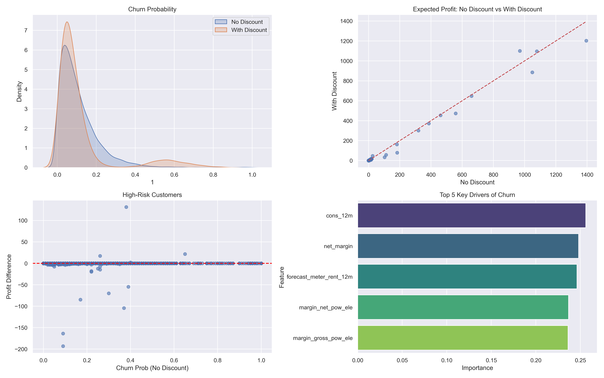

# Portfolio
---

## Data Analyst

### Customer & Retail Insights

Analyzed customer behavior and retail trials to uncover key sales drivers, identify top-performing segments, and deliver actionable, data-driven recommendations for strategic decision-making.

 

 

## Data Science

### Kaggle Competition: House Prices Prediction

I explored the Ames Housing dataset, performed comprehensive EDA, handled missing values and outliers, engineered features, and ensembled Lasso, Ridge, LightGBM, and XGBoost models to predict house prices. My best model achieved RMSLE of 0.11983, ranking 139/4,256 participants (~Top 3.3%) on the Kaggle leaderboard.

 

 

### SmartChurn: Targeted Discounts for Customer Retention

I analyzed customer churn for a utility company. By predicting churn, identifying key drivers, and simulating targeted 20% discounts, I demonstrated that selective interventions can increase profit without blanket price cuts. I also optimized a Random Forest model, showcasing skills in Python, machine learning, and data-driven business strategy.

 

 

### Analyzing Multiclass Land Cover and Spatial Point Patterns on Sentinel-2 Imagery Using Machine Learning and Deep Learning

In this project, I trained predictive models using Machine Learning (Support Vector Machine, Naive Bayes) and Deep Learning (Backpropagation Neural Network) on geospatial datasets from Sentinel-2 imagery. The best-performing model, SVM, achieved 91.15% accuracy in 2022 and 83.90% in 2023 using three classes. I then analyzed spatial patterns and identified high-density non-vegetation (building) areas and potential growth zones within 3–5 km of UNRI.

 

 
