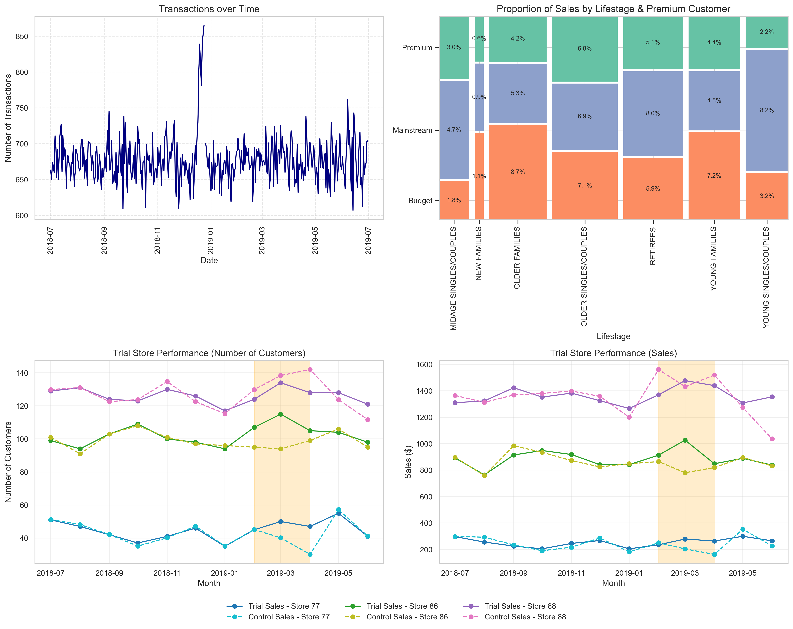
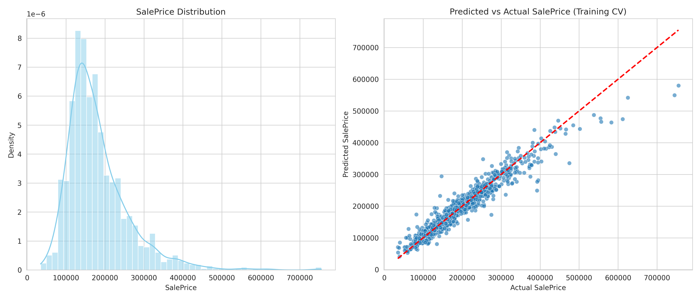
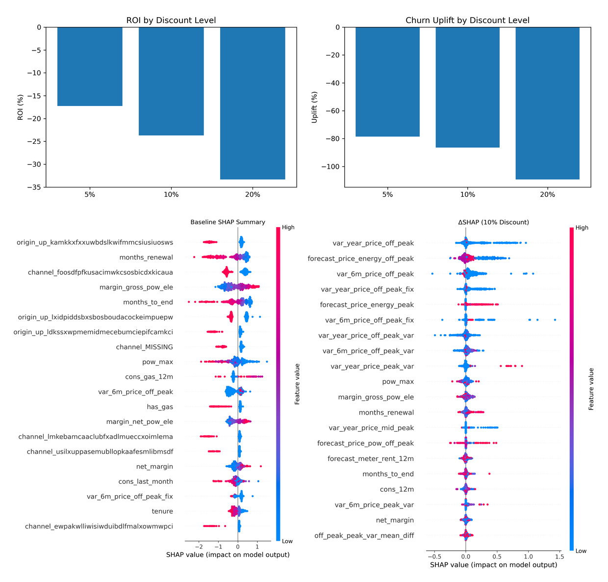
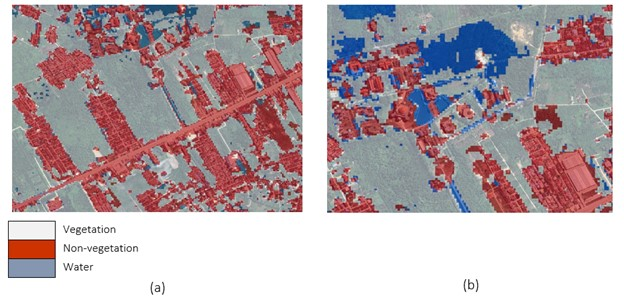

# Portfolio
---
## Data Analyst

### Customer & Retail Insights

I analyzed over **246k retail transactions** to uncover high-value customer segments and evaluate a store-level promotional trial. By understanding customer behavior and engagement patterns, the project helped identify strategies that **increased sales and improved customer engagement**.  

## Data Science

### Kaggle Competition: House Prices Prediction

Using the Ames Housing dataset, I conducted **full exploratory data analysis, handled missing values and outliers, and engineered features**. I ensembled multiple models—Lasso, Ridge, LightGBM, and XGBoost—to predict house prices. The best model achieved **RMSLE 0.11983**, ranking **Top 3.3% on Kaggle**, demonstrating strong predictive performance and careful feature engineering.  

### SmartChurn: Predicting & Explaining Customer Churn

Customer churn is tricky: companies often give discounts to retain customers, but do these really help? In SmartChurn, I analyzed **14k+ energy customers** and found that **blanket discounts (5–20%) often increased churn and reduced ROI**.  

Using **XGBoost**, I predicted which customers were at risk, and with **SHAP**, I discovered the main drivers: **price variability, contract timing, and engagement channels**. This allowed me to propose **targeted retention strategies**—focusing on high-risk customers instead of across-the-board discounts—protecting revenue and strengthening customer trust.  

### Land Cover Classification on Sentinel-2 Imagery

I trained machine learning (SVM, Naive Bayes) and deep learning (Backpropagation Neural Network) models on **Sentinel-2 geospatial data** to classify land cover. The best SVM model achieved **91.15% accuracy in 2022** and **83.90% in 2023** across three classes. I then analyzed spatial point patterns to **identify high-density building areas and potential growth zones**, supporting urban planning insights.  

© 2025 Muna Faizatun Nabilah. Powered by Jekyll and the Minimal Theme.

