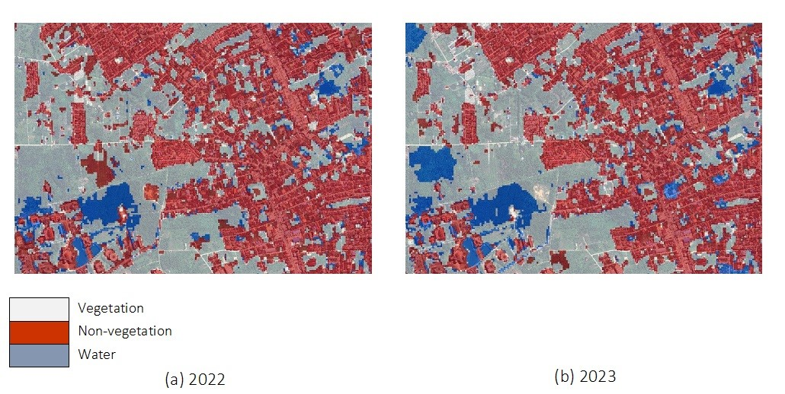

# Portfolio
---
## Data Science

### E-Commerce Analytics: Insights for Growth & Retention

In this project, I explored online retail transactions to uncover customer behavior, top-selling products, customer segments, high-value buyers, and cross-selling opportunities. The goal is to provide actionable insights for marketing strategies that enhance retention and boost revenue.

 

 

### Wind Disaster Risk Analysis in Sleman Regency

I performed comprehensive EDA on the Sleman dataset, then applied K-Means and DBSCAN clustering to identify high-risk districts, track annual trends and outliers, and highlight key risk factors such as fallen trees, power disruptions, and incident frequency.

 

 

### Analyzing Multiclass Land Cover and Spatial Point Patterns on Sentinel-2 Imagery Using Machine Learning and Deep Learning

In this project, I trained predictive models using Machine Learning (Support Vector Machine, Naive Bayes) and Deep Learning (Backpropagation Neural Network) on geospatial datasets from Sentinel-2 imagery. The best-performing model, SVM, achieved 91.15% accuracy in 2022 and 83.90% in 2023 using three classes. I then analyzed spatial patterns and identified high-density non-vegetation (building) areas and potential growth zones within 3–5 km of UNRI.

 

 
